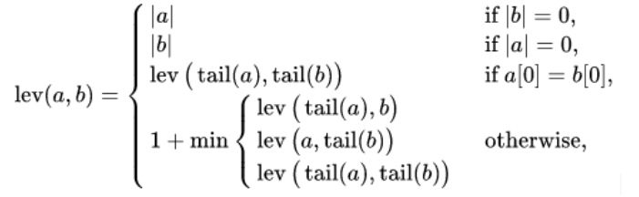
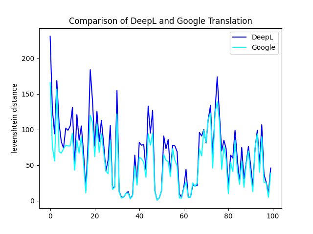

# DeepL vs. Google Translate

## Introduction
This study is a personal project that compares Google’s Neural Machine Translation with DeepL, a small German startup claiming to have outdone the tech giant in terms of the accuracy of its machine translation software.

Specifically, this study looks at English to French translation.

## Metrics
1. Levenshtein distance

I implement the dynamic programming version from [Wikipedia](https://en.wikipedia.org/wiki/Levenshtein_distance).



I modify the implementation such that it measures the distance by word, not by character.

2. METEOR.

This metric was originally introduced in 2005 by [Banerjee & Lavie](https://aclanthology.org/W05-0909.pdf). For now, I do not include the penalty for word order, and simply computed the weighted harmonic mean.

## Dataset
The text being translated is the prose of HG Wells' War of the Worlds, Book 1. 🚀 The French Translation is by Henry-D Davray.
Both text copies were retrieved from Project Gutenberg.

All quotation marks have been removed from the text, as they caused encoding issues. Non-prose (such as chapter names, chapter numbers, and markings for illustrations) has been manually removed. In particular, the French text was alligned by paragraphs with the English text.

## Running the Experiment

The text is pre-translated in `preprocessing.py` and saved in `sentences.csv`. You need a deepl auth key for this.

To run the data analysis for yourself (in the `/src` directory):
```
python analysis.py
```

To run the unit tests (in the root directory):
```
python test.py
```

## Results

Preliminary results suggest that both DeepL and Google differ significantly from the Human translation, but that there is only about a 30% difference between Google and DeepL's translations directly. 

