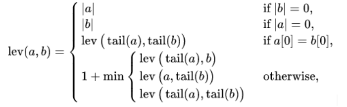
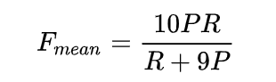
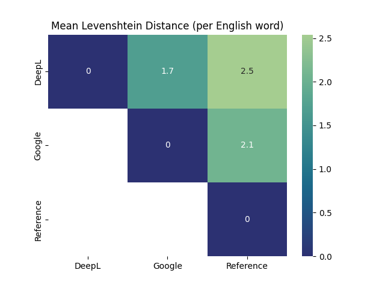
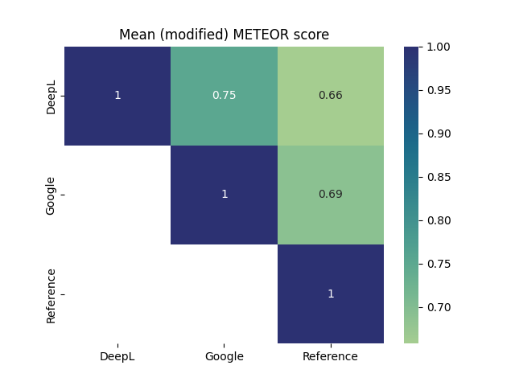

# DeepL vs Google Translate

## Introduction
This study is a personal project that compares Google’s Machine Translation with DeepL, a German startup claiming to have outdone the silicon valley giant in terms of the accuracy of its machine translation software.

Specifically, this study compares Google Translate with  DeepL's Python API in English to French translation, by translating a large dataset of text and comparing it using two key metrics to a reference translation by a human translator. I hope to determine which service, if either, has an edge over the other.

## Metrics
1. Levenshtein distance

I implement the dynamic programming version from [Wikipedia](https://en.wikipedia.org/wiki/Levenshtein_distance).



I modify the implementation such that it measures the distance by word, not by character.

2. METEOR.

METEOR (Metric for Evaluation of Translation with Explicit ORdering) was originally introduced in 2005 by [Banerjee & Lavie](https://aclanthology.org/W05-0909.pdf). For simplicty, the current implementation is modified; I do not include the penalty for word order, and simply compute the weighted harmonic mean.



## Dataset
I use the WMT-14 fr-en dataset, test split, which contains 3003 translated sentences. The data is available from [HuggingFace](https://huggingface.co/datasets/wmt/wmt14).

The text is pre-translated in `load_data.py` and saved in `sentences.csv`. You need a DeepL auth key for this.

## Running the Experiment
To run the data analysis for yourself (in the `/src` directory):
```
python analysis.py
```

To run the unit tests (in the root directory):
```
python test.py
```

## Results

Results from analysis of the data suggest that both DeepL and Google differ significantly from the reference/human translation in Levenshtein Distance and METEOR score. While both services' translations are more similar to each other than to the references<sup>1</sup>, Google seems to approach more closely the reference translation, having a higher METEOR score and lower levenshtein distance to the reference than DeepL does.

**I conclude that Google has a slight edge over DeepL.**





<sup>1</sup>This could be due to more artistic (less literal) translation by the human translator or to similarities in the architecture and training of the translation models used by DeepL and Google.