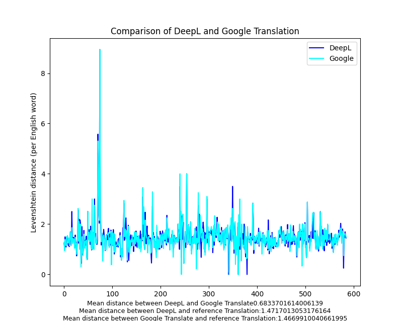
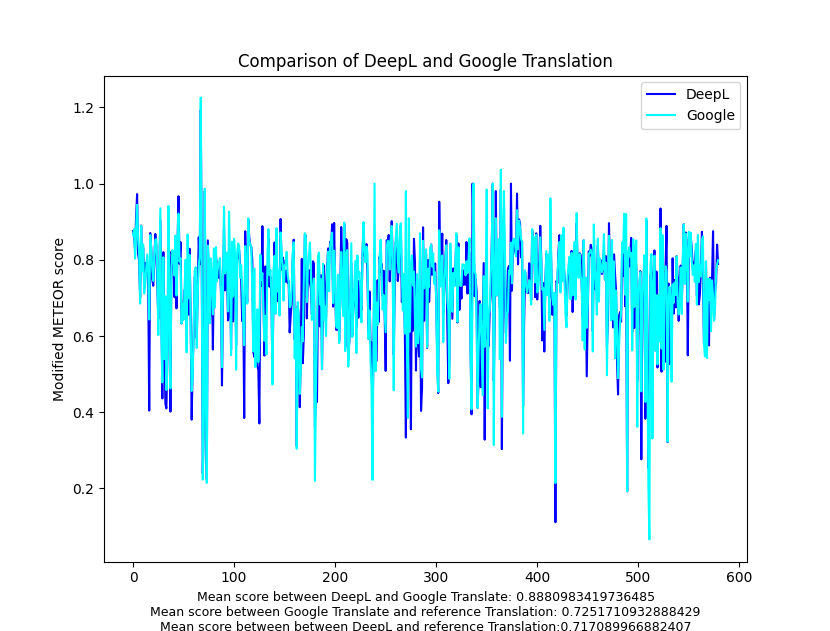

# DeepL vs. Google Translate

## Introduction
This study is a personal project that compares Google’s Neural Machine Translation with DeepL, a small German startup claiming to have outdone the tech giant in terms of the accuracy of its machine translation software.

Specifically, this study compares Google and DeepL's Python APIs in English to French translation, by translating a large dataset of text and comparing it (using two key metrics below) to a reference translation by a human translator. I hope to determine which service, if either, has an edge over the other.

## Metrics
1. Levenshtein distance

I implement the dynamic programming version from [Wikipedia](https://en.wikipedia.org/wiki/Levenshtein_distance).


I modify the implementation such that it measures the distance by word, not by character.

2. METEOR.

METEOR (Metric for Evaluation of Translation with Explicit ORdering) was originally introduced in 2005 by [Banerjee & Lavie](https://aclanthology.org/W05-0909.pdf). For simplicty, the current implementation is modified; I do not include the penalty for word order, and simply compute the weighted harmonic mean.


## Dataset
The English text being translated is the prose of HG Wells' War of the Worlds, Book 1. 🚀 The French Translation is by Henry-D Davray.
Both text copies were retrieved from Project Gutenberg.

All quotation marks have been removed from the text, as they caused encoding issues. Non-prose (such as chapter names, chapter numbers, and markings for illustrations) has been manually removed. In particular, the French text was alligned by paragraphs with the English text.

## Running the Experiment

The text is pre-translated in `preprocessing.py` and saved in `sentences.csv`. You need a deepl auth key for this.

To run the data analysis for yourself (in the `/src` directory):
```
python analysis.py
```

To run the unit tests (in the root directory):
```
python test.py
```

## Results

Results from analysis of the tokenized data suggest that both DeepL and Google differ significantly from the reference/human translation in levenshtein distance and METEOR score. This could be due to more artistic (less exact or literal) translation by the human translator. However, neither seems much better than the other. If one were better, we would see it as much lower Levenshtein distance or higher METEOR score in the charts below.

Instead, we see little difference between Google and DeepL's translations directly. These are much closer correlated than either machine translation to the reference translation.

I conclude that neither translation service is better than the other.



